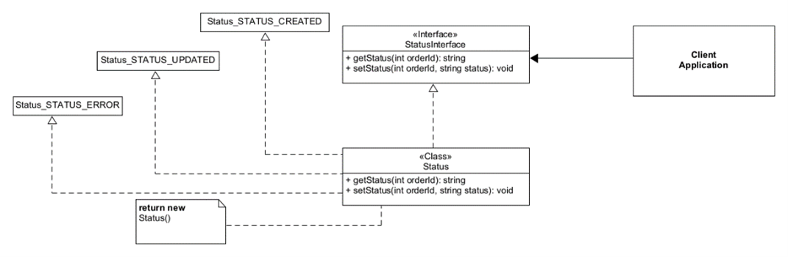
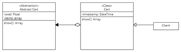
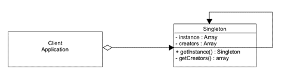

# ECOM-System

### Wymagania
[Docker](https://docs.docker.com/engine/install/ubuntu/)

[docker-compose](https://docs.docker.com/compose/install/)

[Node](https://nodejs.org/en/download/)

[PHP 8.0](https://www.php.net/)

[Composer](https://getcomposer.org/download/)

### Instalacja
`git clone https://github.com/Zevcore/ecom-system.git`

`bash start.bash`

### Opis aplikacji
Aplikacja sklepu internetowego typu e-commerce. Została zbudowana za pomocą
frameworku Vue do wydzielenia clienta oraz Laravel do REST API. Backend komunikuje się
z frontendem za pomocą requestów HTTP. Dodatkowo została wykorzystana baza danych MySQL, która
przechowuje dane pobierane przez API. Aplikacja CMS zbudowana jest na Vue.js v3 i komunikuje się z REST API poprzez protokół HTTPS.

### Członkowie zespołu
- Piotr Jarema - Scrum Master
- Maciej Wójcik - Project Manager
- Mikołaj Pięcek - Developer
- Dariusz Letkiewicz - Graphic Designer

Aplikacja, której kodu użyto do identyikacji wzorców projektowych: **Projekt z przedmiotu Projekt Systemu Informatycznego**

### Wzorce projektowe

#### Fabryka abstrakcyjna
##### Opis wzorca:
Fabryka abstrakcyjna jest **kreacyjnym** wzorcem projektowym, który pozwala tworzyć rodziny spokrewnionych ze sobą obiektów bez określania ich konkretnych klas.

##### Przykładowy diagram UML wzorca:

##### Opis wzorca na przykładzie znalezionego zastosowania:
Wzorzec został zastosowany w plikach w katalogu api/app/Lib/Status. Utworzony został interfejs (`StatusInterface.php`) oraz klasa go implementująca (`Status.php`). Mechanizm ten został zastosowany przy tworzeniu zamówień do dodawania oraz edycji statusu zamówienia.

##### Diagram UML wzorca na przykładzie znalezionego zastosowania:

#### Most
##### Opis wzorca:
Most jest strukturalnym wzorcem projektowym pozwalającym na rozdzielenie dużej klasy lub zestawu spokrewnionych klas na dwie hierarchie — abstrakcję oraz implementację. Nad obiema można wówczas pracować niezależnie.

##### Przykładowy diagram UML wzorca:

##### Opis wzorca na przykładzie znalezionego zastosowania:
Wzorzec Most został zastosowany w plikach katalogu `api\app\Lib\Cart`. Abstrakcja jest zawarta w pliku `AbstractCart.php` i zaimplementowana w pliku `Cart.php`.

##### Diagram UML wzorca na przykładzie znalezionego zastosowania:

#### Strategia
##### Opis wzorca:
Strategia to **behawioralny** wzorzec projektowy pozwalający zdefiniować rodzinę algorytmów, umieścić je w osobnych klasach i uczynić obiekty tych klas wymienialnymi.

##### Przykładowy diagram UML wzorca:

##### Opis wzorca na przykładzie znalezionego zastosowania:
Wzorzec strategii został zaimplementowany w zakresie modułu tworzenia zamówień. Jego główna strategia zawarta jest w pliku `api/app/Models/Order.php`. Klasa będąca kontekstem we wzorcu to `api/app/Http/Controllers/OrderController.php`.
W metodzie store zawartej w kontekście ustawiany jest odpowiedni status poprzez klasę `api/app/Lib/Status/Status.php` w której wyszukiwany jest wybrany model strategii.

##### Diagram UML wzorca na przykładzie znalezionego zastosowania:

#### Singleton
##### Opis wzorca:
Singleton jest **kreacyjnym** wzorcem projektowym, który pozwala zapewnić istnienie wyłącznie jednej instancji danej klasy. Ponadto daje globalny punkt dostępowy do tejże instancji.

##### Przykładowy diagram UML wzorca:

##### Opis wzorca na przykładzie znalezionego zastosowania:
Wzorzec wykorzystano w pliku `api/app/Lib/Creators.php`. Zawiera on informacje o twórcach aplikacji i używany jest w pliku `api/app/Http/Controllers/CmsController.php` w celu wyświetlenia ich na stronie głównej aplikacji CMS.

##### Diagram UML wzorca na przykładzie znalezionego zastosowania:

